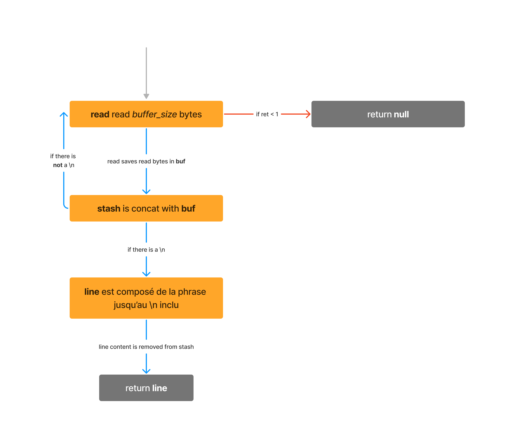

<div align="center">

# get_next_line
#### *Reading a line from a fd is way too tedious*


</div>

Third project for [42 school](https://42.fr/en/homepage/). We have to code a function which should let
us read the text file pointed to by the file descriptor, one line at a time.

## Prototype

```c
char	*get_next_line(int fd);
```

## Parameter

`fd` : the file descriptor to read from

## Return value

✅ Read line (correct behavior)
❌ `NULL` if there is nothing else to read or an error occured

## Usage

Repeated calls (e.g, using a loop) to the function should let us read the text file pointed to by the file descriptor, one line at a time.

##### test.txt (file to read)
```c
Hello World
I'm reading
a line

Incredible.
```

##### main.c
```c
#include <fcntl.h>
#include <stdio.h>
#include "get_next_line.h"

int	main(void)
{
	int	fd;
	char	*line;

	fd = open("./test", O_RDONLY);
	line = "";
	while (line)
	{
		line = get_next_line(fd);
		printf("%s", line);
	}
	return (0);
}
```

#### Output
`null` is displayed because there is nothing more to read.
```txt
Hello World
I'm reading
a line

Incredible.(null)
```

## Method



## Tests
### [gnlTester](https://github.com/Tripouille/printfTester)


### [francinette](https://github.com/xicodomingues/francinette/blob/master/testers/printf)


### [francinette --strict](https://github.com/xicodomingues/francinette/blob/master/testers/printf)


*`timeout` are "normal" for `giant_line.txt` and `giant_text_nl.txt`. Indeed, execution time exceed 10s required to passed these tests.* 